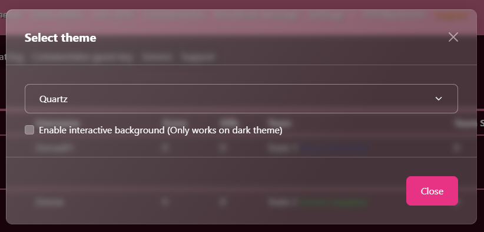
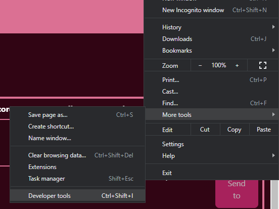
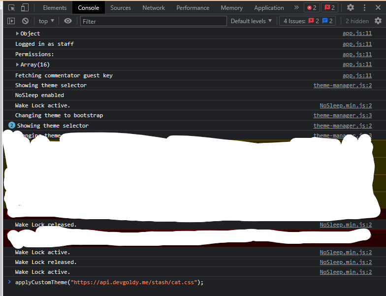
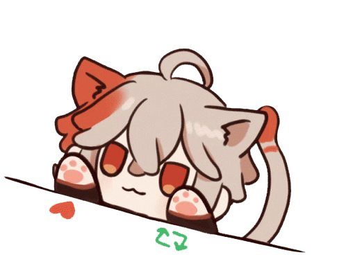

<div align="center">

  # 🐈 Tournament Admin - *Cat Theme*

  

</div>

## 🛠 How to Install

1. #### Change theme to ``Quartz``.

	


2. #### Navigate to your browser's developer tools. *(The example image below is for chrome)*

	


3. #### Got to the ``console`` and run this line of code below:

	```javascript
	applyCustomTheme("https://api.devgoldy.me/stash/cat.css");
	```

	

4. #### Done, enjoy! 🥰

	
